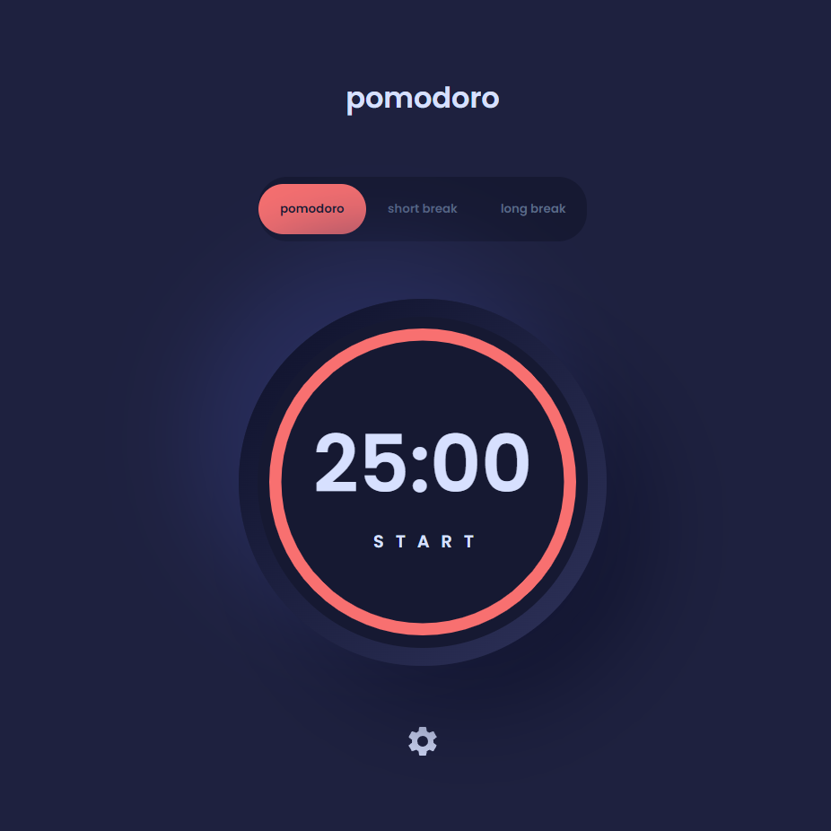

# Pomodoro App

This project was created for learning Next.js 13 using a challange of [frontendmentor.io](https://www.frontendmentor.io/challenges/pomodoro-app-KBFnycJ6G).

## 📸 Screenshots



## 💻 Deploy
https://pomodoro-app-raulval.vercel.app/

## 🧪 Technologies

The project was developed using the following technologies:

- [React](https://reactjs.org)
- [Next.js](https://www.nextjs.org/)
- [Redux](https://redux.js.org)
- [Styled-Components](https://styled-components.com/)

## 🚀 Getting started

Clone the project and access the folder:

```bash
$ git clone https://github.com/raulval/pomodoro-app.git && cd pomodoro-app
```

Follow the steps below:
```bash
# Install all dependencies
$ yarn

# Start the project
$ yarn dev

```


## 📝 License

This project is licensed under the MIT License. See the [LICENSE](LICENSE.md) file for details.
